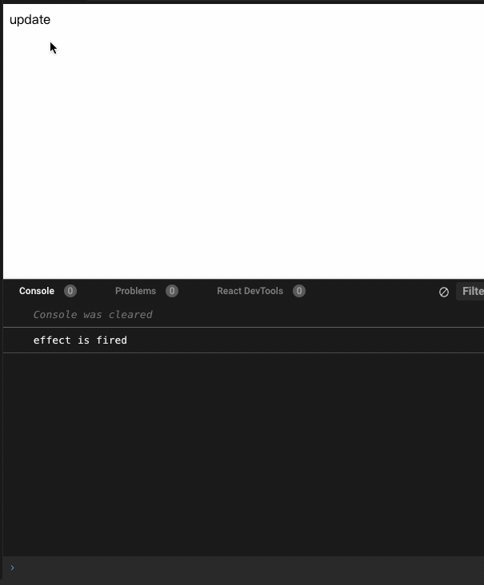
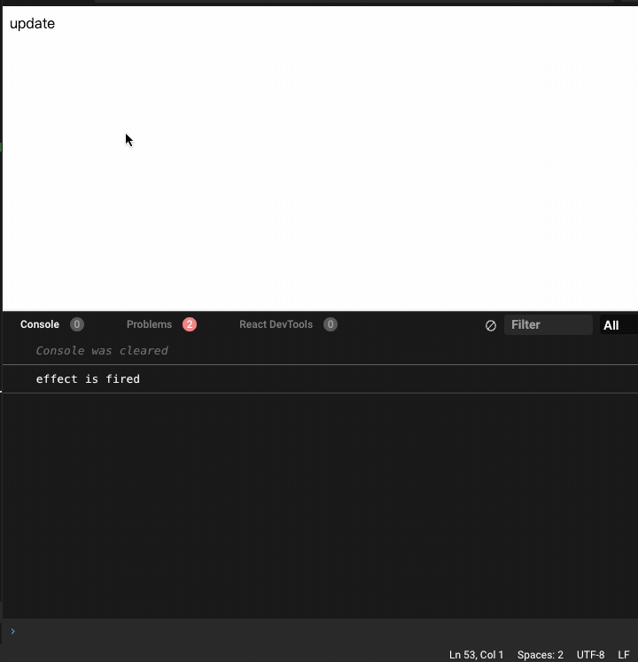

# detect-dependencies-hook

detect which variable in useEffect's dependency array triggers a function re-fire<br>

检测useEffect中那个依赖触发的更新

## install
```
npm install detect-dependencies-hook
```

### api

useDetectDependencyEffect
- effect: React.EffectCallback
- dependencies: React.DependencyList
- diffCallback?: (diffs: any[]) => void


## examples

```js
export default function App() {
  const [random, setRandom] = useState(0);
  const [random2, setRandom2] = useState(0);

  useEffect(() => {
    console.log("effect is fired");
  }, [random, random2]);

  return (
    <div>
      <div
        onClick={() => {
          setRandom(Math.random());
          setTimeout(() => {
            setRandom2(Math.random());
          }, 1000);
        }}
      >
        update
      </div>
    </div>
  );
}
```

```js
export default function App() {
  const [random, setRandom] = useState(0);
  const [random2, setR2] = useState(0);

  useDetectDependencyEffect(
    () => {
      console.log("effect is fired");
    },
    [random, random2],
    (diffs) => {
      console.log("diff dependencies：", diffs);
    }
  );
  return (
    <div>
      <div
        onClick={() => {
          setRandom(Math.random());
          setTimeout(() => {
            setR2(Math.random());
          }, 1000);
        }}
      >
        update
      </div>
    </div>
  );
}
```

## link

[Determine which dependency array variable caused useEffect hook to fire](https://stackoverflow.com/questions/55187563/determine-which-dependency-array-variable-caused-useeffect-hook-to-fire)